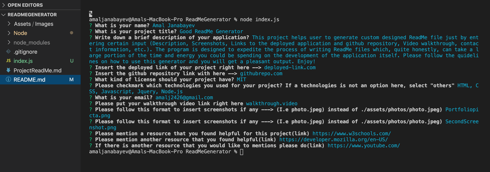
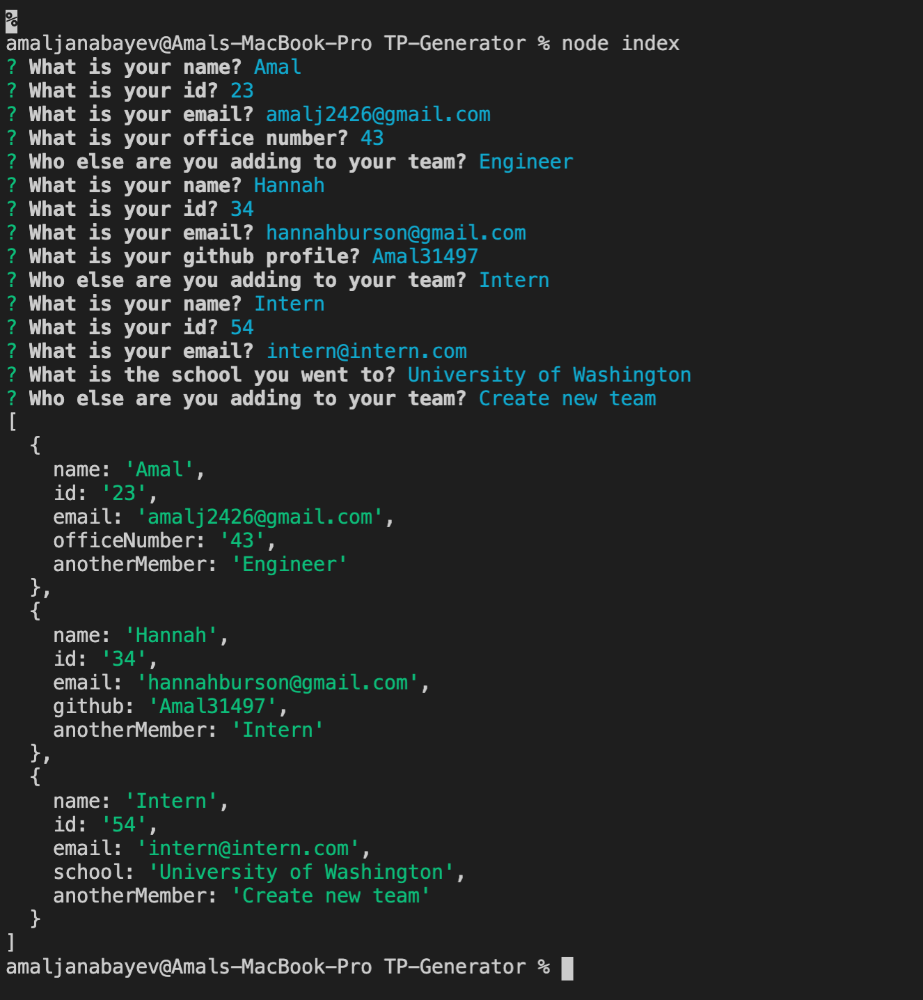
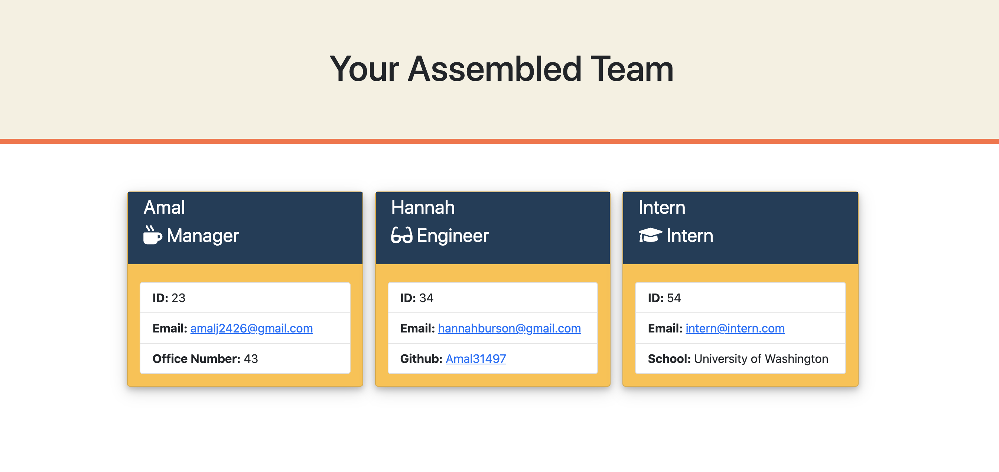

# Team Profile Generator 

   
  This application allows user to generate an predesigned interface that displays the team selected by the User. As the application runs, user has to input information about each member of the team. The options are -- > (Manager - default, Engineer, Intern). After the user runs the application(Read further for instructions), a new page is created. 

   

   [Deployed last version]()

   [Github repo](https://github.com/Amal31497/Team-Profile-Generator)

   

  ## Table of Contents 
 
  ##### * [Technologies used](#Technologies)
  ##### * [Usage walkthrough](#Walkthrough)
  ##### * [Installation](#Installation)
  ##### * [Credits](#Credits)
  ##### * [License](#License)
  ##### * [Contact Info](#Contact)

  ## Technologies:
   _*HTML,CSS,Javascript,Node.js,Others*_

  ## Walkthrough:
  #### Video:
  Please follow this *[link](https://www.youtube.com/watch?v=NYED6wW3_A8)* to watch the walkthrough video.

  #### Screenshots:
  
  
  

  ## Installation:
  Run the following commands in your integrated terminal to initalize the application:

    1. git clone git@github.com:Amal31497/Team-Profile-Generator.git

    2. npm i

    3. node index

    4. Answer all the questions accordingly

    5. Get the output in a form of a new custom generated team.html file
  
  ## Credits:
  [w3schools.com](w3schools.com)
  [https://developer.mozilla.org/en-US/](https://developer.mozilla.org/en-US/)

  ## License: 

  ##### Copyright: Amal Janabayev

  ##### 

  ##### [License Link](https://opensource.org/licenses/MIT)

  ## Contact: 

  ##### amalj2426@gmail.com